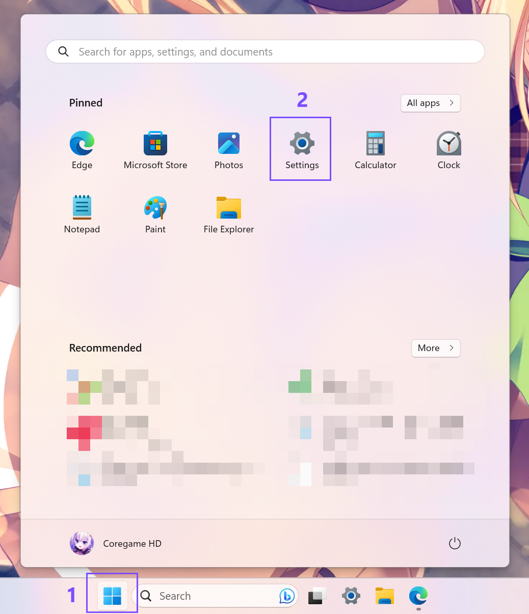
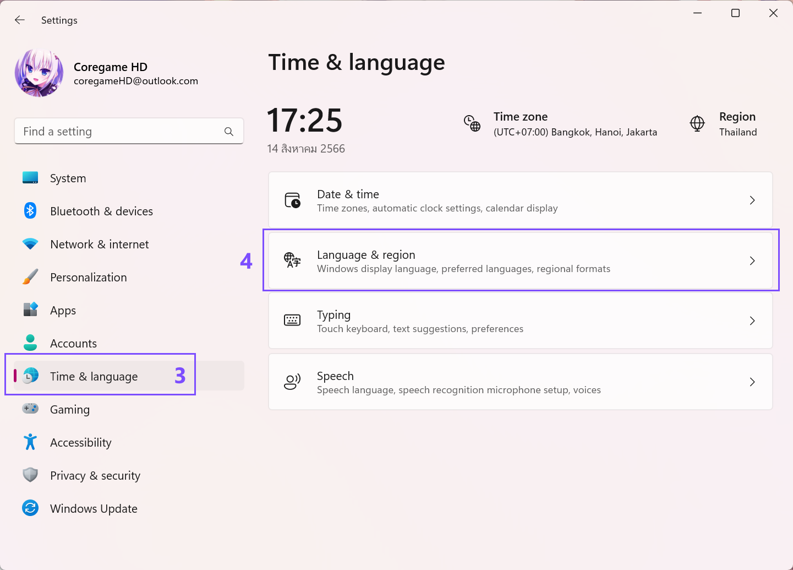
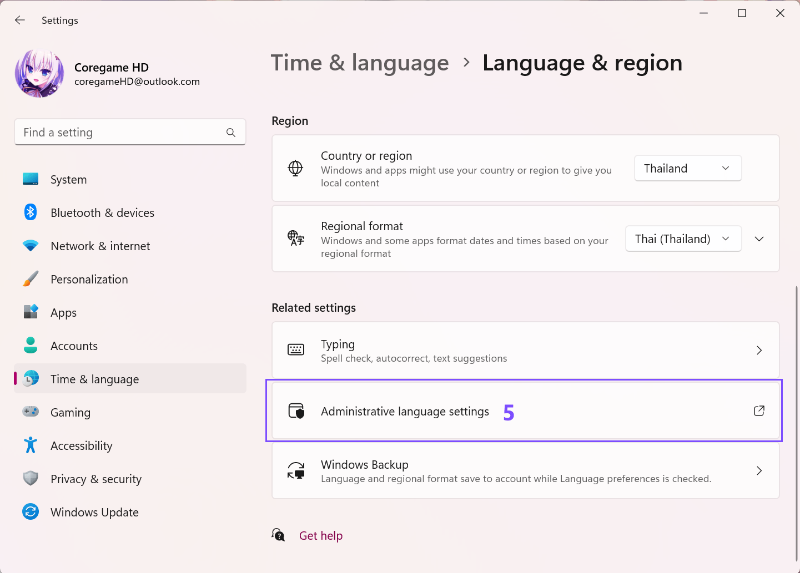
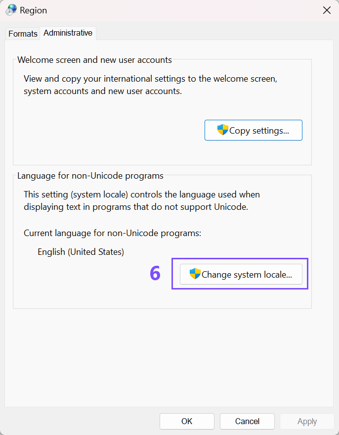
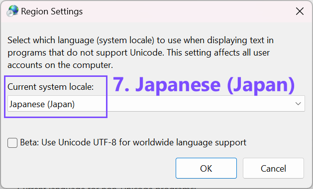

<Tip>**Tip:** หากไม่ต้องการเปลี่ยน Locale สามารถใช้โปรแกรม [Locale Emulator](https://xupefei.github.io/Locale-Emulator) แทนได้</Tip>

เกมเอโรเกะส่วนมากกำหนดว่าคอมพิวเตอร์ที่ติดตั้งต้องเป็นภูมิภาคประเทศญ๊่ปุ่นเท่านั้น หากเป็นภูมิภาคอื่น (เช่น ประเทศไทย) จะไม่สามารถเปิดเกมได้

บทความนี้จะแนะนำวิธีการเปลี่ยนภูมิภาคในคอมพิวเตอร์เป็นประเทศญี่ปุ่น ใช้เวลาประมาณ 3 นาที จำเป็นต้อง Restart คอมพิวเตอร์หนึ่งครั้ง

### วิธีเปลี่ยนภูมิภาค (locale) สำหรับ Windows 11

1. ไปที่ **Start** --> แล้วเลือก **Settings**

หากหา Settings ไม่เจอ สามารถค้นหาด้วยการพิมพ์ที่ช่องค้นหา

2. บริเวณเมนูด้านซ้าย เลือก **Time & Language** --> **Language & region**

3. เลือก **Administrative language settings**

4. เลือกแท็บ Administrative จากนั้นคลิ๊กที่ปุ่ม **Change system locale...**

5. เลือก `Japanese (Japan)` จากนั้นกดปุ่ม OK และทำการ restart คอมพิวเตอร์หนึ่งครั้ง

### วิธีเปลี่ยนภูมิภาค (locale) สำหรับ Windows 11

@todo เพิ่ม tutorial สำหรับ win10