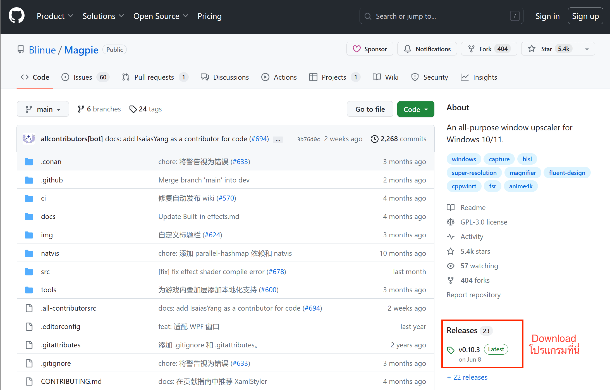
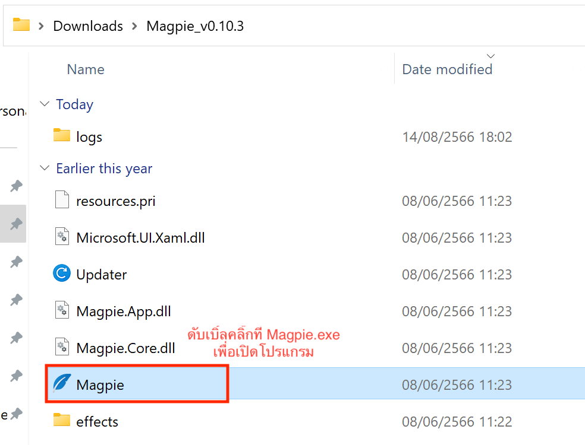
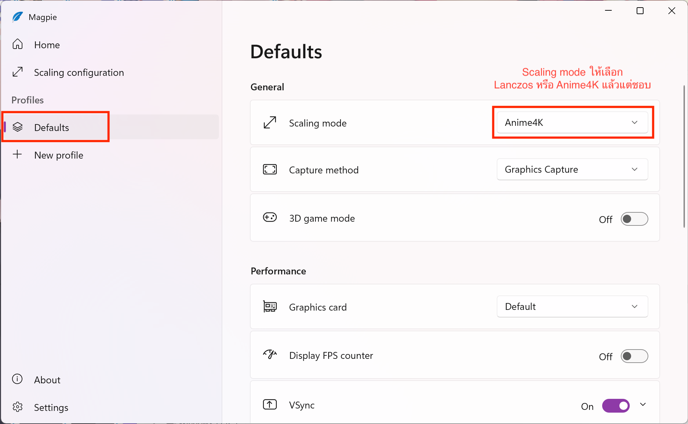
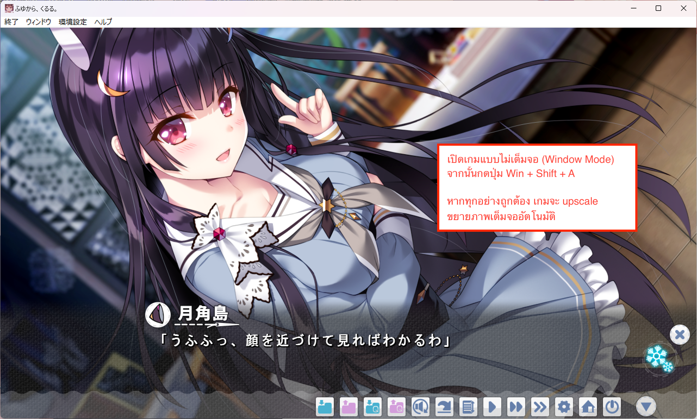
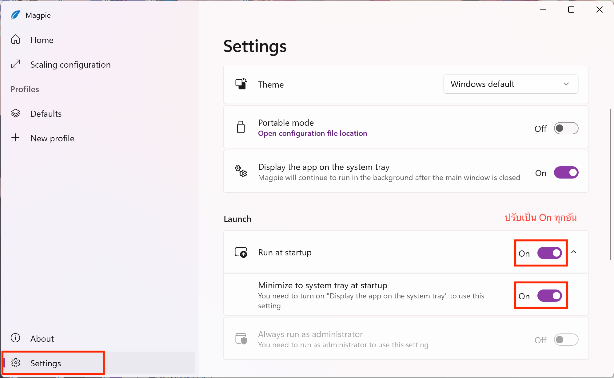

เกมเอโรเกะเก่าๆ หรือแม้แต่เกมในยุคปัจจุบันหลายเกมมาพร้อมกับภาพความละเอียด 720p (1280 x 720 px) ส่งผลให้ภาพไม่คมชัดเท่าที่ควรเมื่อนำไปแสดงผลในจอภาพที่มีความละเอียดสูง

Magpie เป็นโปรแกรมที่ช่วยขยายภาพ (upscale) ในเกมเอโรเกะให้มีความละเอียดสูงขึ้น ทำให้ภาพคมชัดกว่าเดิมหลายเท่า มองเห็นความแตกต่างได้อย่างชัดเจน

### Requirements

โปรแกรม Magpie รองรับ
- Windows 10 เวอร์ชั่น 1903 ขึ้นไป
- Windows 11 ทุกเวอร์ชั่น

### Download

ดาวน์โหลดโปรแกรม Magpie ได้ที่ [https://github.com/Blinue/Magpie](https://github.com/Blinue/Magpie)

คลิ๊กตรง Release --> จากนั้นเลือกเวอร์ชั่นล่าสุดที่มีในขณะนั้น (ตัวอย่างคือ `v0.10.3`) --> แล้วคลิ๊ก `Magpie_v0.10.3.zip` เพื่อทำการดาวน์โหลดโปรแกรม

### Installation

1. แตกไฟล์ zip ที่ดาวน์โหลดไว้ --> จากนั้นดับเบิ้ลคลิ๊กที่ **Magpie.exe**

2. เลือกที่ Profile --> **Defaults**

3. บริเวณ General --> **Scaling Mode** ให้เลือกเป็น **Lanczos** หรือ **Anime4K** แล้วแต่ชอบ

4. เปิดเกมแบบไม่เต็มจอ (Window Mode) จากนั้นกดปุ่ม `Win` + `Shift` + `A`

หากทำทุกอย่างถูกต้อง เกมจะ upscale ขยายเต็มจอโดยอัตโนมัติ

### Tips

เพื่อความสะดวกในการใช้งาน แนะนำให้ตั้งค่าให้โปรแกรม Magpie เริ่มทำงานเมื่อเปิดคอมพิวเตอร์โดยอัตโนมัติ

ไปที่ **Settings** ของโปรแกรม Magpie จากนั้นตั้งค่าตามนี้

- Run at Startup ปรับเป็น **On**
- Minimize to system tray at startup ปรับเป็น **On**

### ข้อจำกัด

เมื่อทำการ upscale เกม อาจพบปัญหาดังต่อไปนี้

- รู้สึกหน่วงเมื่อขยับเมาส์ ยังไม่พบวิธีแก้ไข
- การแสดงผลข้อความกระพริบ แก้ได้ด้วยการปรับ Text Speed เป็น 100% หรือสูงสุดเท่าที่สามารถปรับได้
- หากใช้โน้ตบุ๊ค พัดลมอาจดังเพราะโปรแกรม Magpie กินทรัพยากรเครื่องมากขึ้น